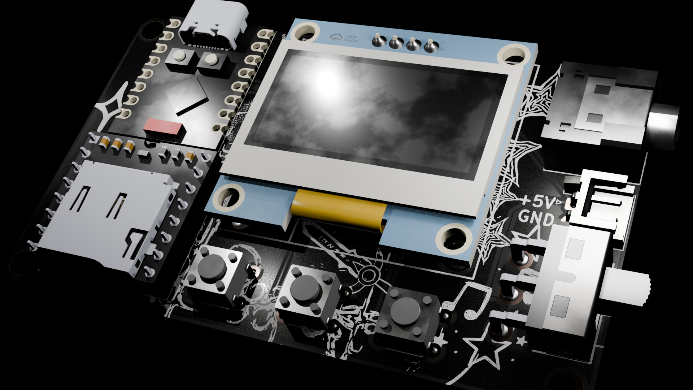
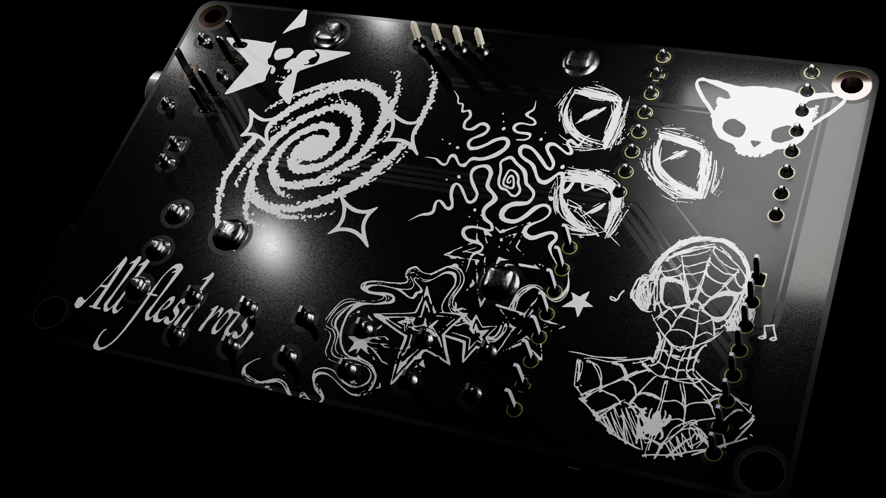
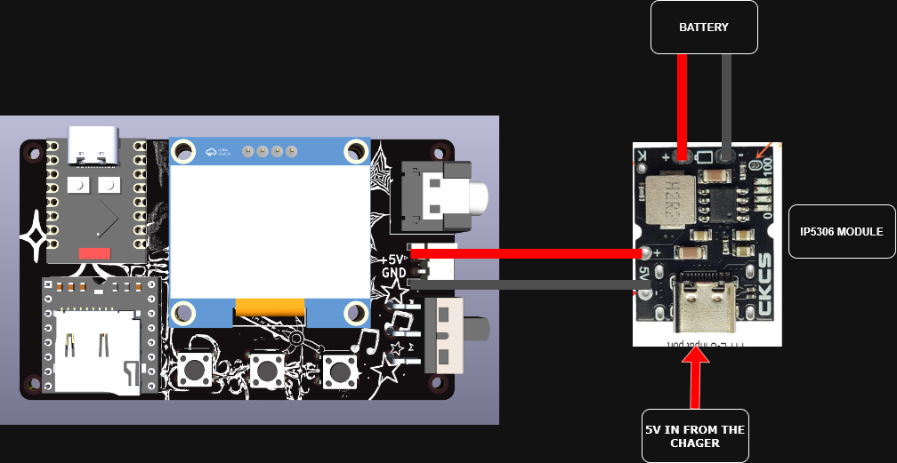

## POCKET PLAYER

## why i built this

 I was heavily inspired by retro tech and how minimal they were so i wanted to recreated something without distraction for myself

 
## Features

- Rechargeable via USB-C
- Plays audio through onboard DFPlayer + speaker
- 1.3" OLED for status/UI
- 3 physical buttons for control
- Built on ESP32-C3 SuperMini — WiFi/BLE ready

## How it works

When a button is pressed, the ESP32-C3 sends a serial command over UART to the DFPlayer Mini, telling it which track number to play from the microSD card. The DFPlayer handles all the actual audio decoding and playback internally ,it reads the MP3 file off the card, decodes it, and outputs the analog signal directly through its onboard DAC and amplifier to the 3.5mm jack. The ESP32 doesn't process any audio itself

  
### Schematic

**Battery wiring note:** the battery is soldered directly to the board
(no JST connector) — see schematic for polarity.

### Bill of Materials

| Value                 | Function               | Footprint                                            | Qty | Price   | Amount  | Amount (USD) | Link                     |
|-----------------------|-------------------------|-------------------------------------------------------|:---:|--------:|--------:|-------------:|---------------------------|
| Conn_01x02            | 2 pin JST connector     | `Connector_JST:JST_EH_S2B-EH_1x02_P2.50mm_Horizontal` |  1  |    —    |    —    |      —       | *Soldered battery directly* |
| Conn_01x05            | 3.5mm jack              | `AUDIOJACK:AUDIOJACK-TH_PJ-306`                       |  1  | ₹10.78  | ₹10.78  |    $0.11     | [Sharvi Electronics][sharvi-jack] |
| SW_Push               | 6mm push button         | `Button_Switch_THT:SW_PUSH_6mm`                       |  3  |  ₹15    |  ₹15    |    $0.16     | [Robu.in][robu-button] |
| SW_SPDT               | SPDT switch             | `Button_Switch_THT:SW-TH_3P-SS12D06-1`                |  1  |  ₹23    |  ₹23    |    $0.24     | [Robu.in][robu-switch] |
| HS96L03W2C03          | 1.3" OLED               | `1.3inch_oled:OLED-TH12864`                           |  1  |  ₹347   |  ₹347   |    $3.62     | [Robu.in][robu-oled] |
| ESP32-C3_SUPERMINI_TH | ESP32-C3 SuperMini      | `ESP32 C3 SUPERMINI:MODULE_ESP32-C3_SUPERMINI_TH`     |  1  | ₹259.63 | ₹259.63 |    $2.71     | [Sharvi Electronics][sharvi-esp32] |
| DFR0299               | DFPlayer Mini           | `DFPLAYER:DFPLAYERMINI`                               |  1  |  ₹89    |  ₹89    |    $0.93     | [Robocraze][robocraze-dfplayer] |
| PCB                   | Main PCB                | —                                                      |  1  |    —    |  ₹899   |    $9.38     | [Robu.in][robu-pcb] |
| Charger               | 5V boost + LiPo charger | —                                                      |  1  |  ₹70    |  ₹70    |    $0.73     | [Flyrobo][flyrobo-charger] |
| 1000mAh battery       | LiPo battery             | —                                                      |  1  | ₹247.36 | ₹247.36 |    $2.58     | [Sharvi Electronics][sharvi-battery] |

**Shipping & Tax**

| Item                  | Price   | Amount  | Amount (USD) |
|-----------------------|--------:|--------:|-------------:|
| Flyrobo shipping      |  ₹59    |  ₹59    |    $0.62     |
| Robocraze shipping    |  ₹49    |  ₹49    |    $0.51     |
| Sharvi Elect shipping |  ₹85    |  ₹85    |    $0.89     |
| Sharvi Elect IGST     | ₹108.49 | ₹108.49 |    $1.14     |
| Robu shipping (PCB)   |  ₹49    |  ₹49    |    $0.51     |
| Robu shipping         |  ₹49    |  ₹49    |    $0.51     |

**TOTAL: $24.64**

<!-- Link references -->
[sharvi-jack]: https://sharvielectronics.com/product/3-5mm-female-stereo-audio-socket-headphone-jack-connector-5-pin-pcb-mount/
[robu-button]: https://robu.in/product/6x6x5-tactile-push-button-switch/
[robu-switch]: https://robu.in/product/ss12d10g5-wj-shou-han-bend-insert-2a-single-pole-double-throw-spdt-125v-3000-times-black-plugin-slide-switches-rohs/
[robu-oled]: https://robu.in/product/1-3-inch-ssd1106-controller-128x64-i2c-communication-interface-oled-display-blue-color-screen/
[sharvi-esp32]: https://sharvielectronics.com/product/esp32-c3-super-mini-development-board-hw-466a-pre-soldered-header/
[robocraze-dfplayer]: https://robocraze.com/products/dfplayer-mini-mp3-module
[robu-pcb]: https://robu.in/
[flyrobo-charger]: https://www.flyrobo.in/5v-2a-type-c-usb-battery-charging-discharging-boost-module
[sharvi-battery]: https://sharvielectronics.com/product/3-7v-1000mah-lipo-rechargeable-battery-with-bms-502535-model/
